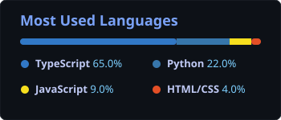

  <!-- Header Banner -->
  

  <!-- Professional Typing Header (Clean Typography, No Emojis) -->
  

   

  <!-- Status & Verified Badges -->
  

    
    
    
    
    
  

  <!-- Connect & Social Profiles (Official Brand Badges Only) -->
  

    
    
    
    
    
  

---

### Profile Overview

Software Engineer and Solutions Architect specializing in **TypeScript-first full-stack architecture**, **autonomous AI agent frameworks**, and **cloud-native data systems**. Focused on delivering maintainable, high-throughput, and type-safe digital solutions.

- **Primary Disciplines:** Enterprise Web Applications, Autonomous Agentic Workflows, Distributed Cloud Architecture.
- **Core Technology Stack:** TypeScript, Next.js, React, Node.js, Python, Google Cloud Platform (GCP), PostgreSQL, Docker.
- **Engineering Principles:** Strict Type Safety, Clean Modular Architecture, Performance Optimization.
- **Direct Contact:** [sahadat.info01@gmail.com](mailto:sahadat.info01@gmail.com)

---

### Technical Competencies

  

 

<table>
  <tr>
    <td width="26%"><strong>Programming Languages</strong></td>
    <td width="74%">
      
      
      
      
      
      
    </td>
  </tr>
  <tr>
    <td width="26%"><strong>AI & Machine Learning</strong></td>
    <td width="74%">
      
      
      
      
    </td>
  </tr>
  <tr>
    <td width="26%"><strong>Frontend Architecture</strong></td>
    <td width="74%">
      
      
      
      
      
    </td>
  </tr>
  <tr>
    <td width="26%"><strong>Backend & APIs</strong></td>
    <td width="74%">
      
      
      
      
    </td>
  </tr>
  <tr>
    <td width="26%"><strong>Cloud & Infrastructure</strong></td>
    <td width="74%">
      
      
      
      
      
      
    </td>
  </tr>
</table>

---

### Analytics & Code Metrics

  <table border="0">
    <tr>
      <td>
        
      </td>
      <td>
        
      </td>
    </tr>
    <tr>
      <td colspan="2" align="center">
        <!-- Most Used Languages Card with TypeScript at 65% -->
        
      </td>
    </tr>
  </table>

---

  <!-- Minimalist Clean Footer -->
  

